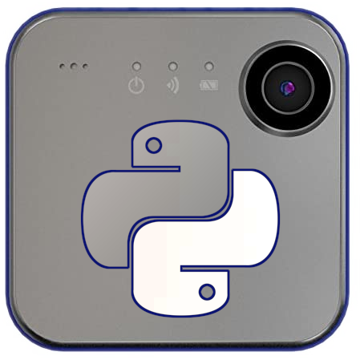
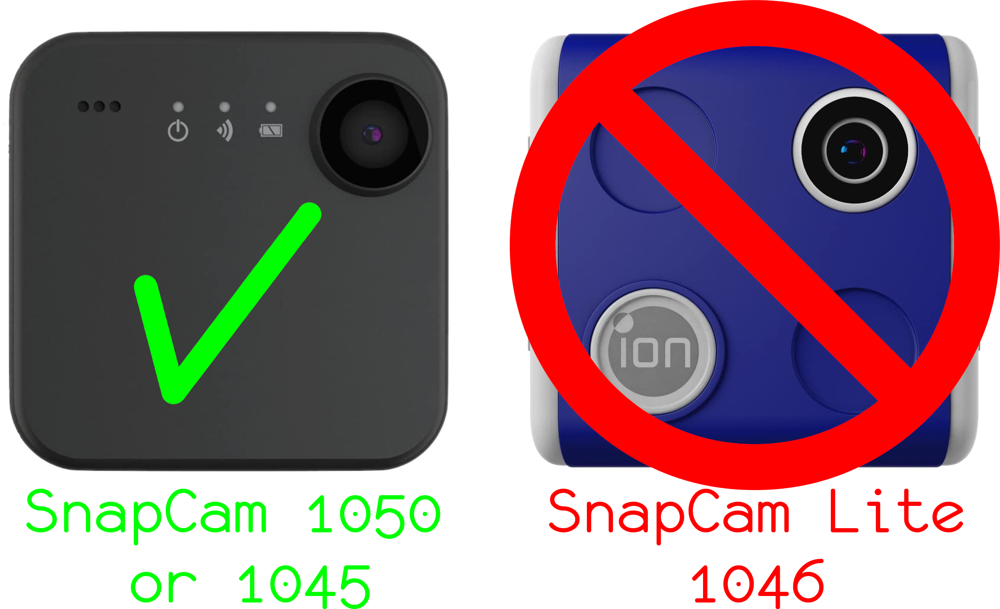

# SnapCam for Python
<p align="center">
  
</p>

<p align="center">
  <a href="https://github.com/psf/black">
    
  </a>
  <a href="https://github.com/targetdisk/snapcam-python/blob/main/LICENSE">
    
  </a>
</p>

## What is a SnapCam?
A SnapCam is a small fixed-focus action camera capable of producing a 720p H.264
video feed with AAC audio from the internal microphone.  It can save the feed in
an `MP4` container to a microSD card, stream the feed in RTSP over WiFi, or do
both of these things simultaneously.

The device appears to use a Broadcom Bluetooth chip (mine is a `BCM20736`) with
an ARM Cortex M3 as the main application processor.  It uses an OmniVision
`OV788` chip (the same chip that the 720p
[first generation Amazon Ring](https://www.exploitee.rs/index.php/Ring_Doorbell)
doorbell uses) for interfacing with the CMOS camera module and real-time 720p
H.264+AAC encoding at 30 fps.  It uses a Wolfson `WM89606` ADC for the
microphone.

The camera first starts up with only Bluetooth-LE enabled.  It uses Bluetooth
for sending picture taking commands, sending video recording commands, and
configuring the camera's various settings.  All commands are in a JSON-like
format with a simple checksum at the end (that the camera never checks).  The
camera will pair with any device upon request with no authentication
whatsoever. 😈

To enable WiFi, you must send a special command (the `Type 22` command) to the
camera's `0x2d` handle using the Bluetooth attributes protocol.  Once that
command is sent, the camera will spin up a WiFi access point on the 2.4GHz band.
If this is your first time connecting to the camera's WiFi, you may also want to
send the `Type 18` command to the camera to get the camera's WiFi SSID and WPA
PSK.  Again, the camera will give this information to you with no authentication
whatsoever.

With WiFi access point enabled, you should be able to connect to it and get an
IP address from the camera's DHCP server on the 192.168.2.0/24 subnet.  Every
SnapCam I've tried so far has its IP address statically assigned to
192.168.2.103.  Once connected, you'll have access to the camera's very secure
(use `admin:admin` for the HTTP basic auth login) web interface on port 80, as
well as the RTSP server running on port 554.  There is also something that my
`nmap` detects running on port 4000, but I have yet to poke around at it.

## Getting a SnapCam
You can buy a SnapCam
[on Amazon](https://www.amazon.com/iON-Camera-SnapCam-Wearable-Bluetooth/dp/B0131DSBN0)
while supplies last.  The OmniVision video encoding/camera ASIC appears to be
[end-of-life](https://www.ovt.com/sensors/OV788), so I'm not sure how long these
will be up for sale online.

### Supported models
Note that this project will only work on the SnapCam models with the onboard
WiFi!  The SnapCam Lite 1046 model uses a completely different application
processor and lacks onboard Bluetooth/WiFi.  Only buy the SnapCam 1050 model if
you intend to try out the code in this repository!  Both are listed on the same
[Amazon page](https://www.amazon.com/iON-Camera-SnapCam-Wearable-Bluetooth/dp/B0131DSBN0),
so be sure to verify that you are purchasing the correct model.

<p align="center">
  
</p>

## What is this repository for?
This is a proof-of-concept that allows you to setup and stream video from an iON
SnapCam without the need for the Android app.  This software was made by
reverse-engineering the Bluetooth traffic of the iON Camera+ app using my
phone's onboard Android developer tools' Bluetooth packet capture.

I have written the `Snapcam` and `SnapcamRTSP` classes that allow you to
interact with and stream video from a SnapCam.

## Installing the Demo
Currently this software only supports running on Linux systems with Python 3.8 or
newer.  It also requires a recent version of `ffmpeg`, and the `v4l2loopback`
kernel module.

### Video4Linux Loopback Setup
You must install the out-of-tree `v4l2loopback`
[kernel module](https://github.com/umlaeute/v4l2loopback).

#### With your distro's v4l2loopback package
If you install the kernel module from your distro's package manager and have the
`/etc/modprobe.d` directory, make a file named
`/etc/modprobe.d/v4l2loopback.conf` with the following contents:
```
options v4l2loopback devices=4 video_nr=2 exclusive_caps=1
```

Once that file is in place, you can `modprobe` the installed kernel module:
```
# modprobe v4l2loopback
```

#### With your own v4l2loopback build
If you build the `v4l2loopback` module
[from GitHub](https://github.com/umlaeute/v4l2loopback), you can `insmod` it
thusly (make sure you build it first):
```
# insmod ./v4l2loopback.ko devices=4 video_nr=2 exclusive_caps=1
```

Currently my software is hardcoded to stream the video to `/dev/video4` (see
`Snapcam/rtsp_util.py` line 54).  A lot of the video processing code will be
rewritten in the future, including the part that only streams to `/dev/video4`.

### Python setup
Set up your virtual environment:
```
$ python3 -m venv .venv
```

Enter your virtual environment:
```
$ . .venv/bin/activate
```

Install the `Snapcam` Python package:
```
(.venv)$ python3 setup.py install
```

## Running the Demos
Plugging in your SnapCam into a micro-USB charger while running the
demo is *highly recommended*, as its battery life is abysmal while streaming
over WiFi.

Hold the power button on the camera until you hear two short beeps.  The camera
should now be on and ready to run the demo.

### Running the Bluetooth messaging demo
The first demo shows how you can use my `Snapcam` class to interact with a
SnapCam 1050.  Run it like so:
```
(.venv)$ python3 examples/demo.py
```

### Running the V4L2 webcam demo
Ensure your computer is connected to the SnapCam's WiFi AP and has gotten a DHCP
address.

Edit the **Bluetooth** MAC address in line 8 of `examples/demo.py` to your
camera's Bluetooth MAC (find it by scanning with `bluetoothctl`):
```python
sc = Snapcam("d4:2c:3d:07:44:60", debug=True)
              ^^^^^^^^^^^^^^^^^
```

Run the demo in a terminal (keep the terminal open):
```
(.venv)$ python3 examples/rtsp-demo.py
```

With the other terminal open, you should now be able to use the SnapCam as a
webcam in any software that uses Video4Linux webcams on Linux like Cheese,
Discord, FFmpeg, MPV, OBS Studio, VLC, or Zoom!

## Notes
- This software currently does not parse the RTP headers at all (will be handled
  in the future in a C extension), leading to some interesting video corruption
  and frame rate fluctuation from out-of-order video packets.
- This is just an initial proof-of-concept.
